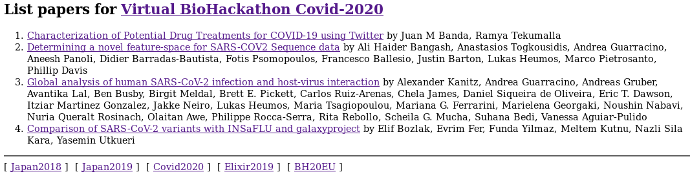

# Introduction

https://biohackrxiv.org/ is a scholarly publication service for
biohackathons and codefests where papers are generated from markdown
templates where the header is a YAML/JSON record that includes the
title, authors, affiliations and tags. Templates are provided as an
[example](https://github.com/biohackrxiv/submission-templates). A
minimal metadata header has the following layout


```js
---
title: 'BioHackrXiv  template'
tags:
  - replace with your own keywords
  - at least is recommended
authors:
  - name: First Last
    orcid: 0000-0000-0000-0000
    affiliation: 1
  - name: Second Last
    orcid: 0000-0000-0000-0000
    affiliation: 2
affiliations:
 - name: Institution 1, address, city, country
   index: 1
 - name: Institution 1, address, city, country
   index: 2
date: 01 January 2020
bibliography: paper.bib
---
```

BioHackrXiv publications are hosted at osf.io, an open source website
that connects and supports the research workflow, enabling scientists
to increase the efficiency and effectiveness of their research. OSF is
run by the non-profit Center for Open Science (COS) and charges for
the handing out of digital object identifiers (DOIs). The OSF site
provides support for basic editorial functions and displaying
PDFs. More importantly it has a basic search infrastructure.

Many projects in biohackathons are about using FAIR data. The OSF site
lacks a number of facilities. For example it is not easy to
straightforward to list publications related to certain biohackathons,
e.g. `biohackathon 2019 Japan'. Another problem is that there is no
clear link between publications and the projects they refer to. It is
necessary to read the PDF for that.

Because the current setup is lacking in the findable (F) and
accessible (A) of FAIR, for the Elixir Biohackathon 2020, we decided
to add an additional service that provides a SPARQL endpoint for
queries and some simple HTML output that can be embedded in a
BioHackathon website.

# Results

## Linking metadata up

To connect the main publication with its source and related markdown
we maintain a [list](./etc/papers.yaml) in a git repository that needs
to be updated with every publication. This file contains hard links we
can not easily acquire in other ways. E.g.

```yaml
papers:
- id: https://biohackrxiv.org/km9ux/
  doi: https://doi.org/10.37044/osf.io/km9ux
  markdown: https://raw.githubusercontent.com/journal-of-research-objects/Example-BioHackrXiv-Paper/master/paper.md
```

The markdown link should be able to fetch the parsable markdown file and fetch
the contained header metadata. Any conflicting metadata added by
[papers.yaml](https://github.com/biohackrxiv/bhxiv-metadata/tree/main/etc)
file overrides the metadata in the markdown file.

Some metadata, such as the DOI, is presented as HTML on the OSF.io web
pages. In future work this data can be scraped to add to the metadata
stored in papers.yaml.

## Transform metadata to RDF

After compiling the metadata we transform that into RDF, the language
of the semantic web, using a small subset of the dublin core and
scholarly publication [ontology](https://schema.org/ScholarlyArticle)
from schema.org [cite].

In the first version we generate RDF with Ruby ERB templates which
means that validation happens in the source code. Some semantic
enrichment includes URIs for the biohackathons themselves. An example
for one paper:

```rdf
<http://2019.biohackathon.org/> schema:description "NBDC/DBCLS BioHackathon, Fukuoka, Japan, 2019"@en ;
    schema:name "Japan2019" ;
    a schema:Event .

<https://biohackrxiv.org/km9ux/> dc:title "Logic Programming Working Group"@en ;
    schema:sameAs <https://doi.org/10.37044/osf.io/km9ux> ;
    schema:url <https://raw.githubusercontent.com/journal-of-research-objects/Example-BioHackrXiv-Paper/master/paper.md> ;
    bhx:Event <http://2019.biohackathon.org/> ;
    a schema:CreativeWork .

<https://biohackrxiv.org/km9ux/> dc:contributor "Chris Mungall"@en .
<https://biohackrxiv.org/km9ux/> dc:contributor "Hirokazu Chiba"@en .
<https://biohackrxiv.org/km9ux/> dc:contributor "Shuichi Kawashima"@en .
<https://biohackrxiv.org/km9ux/> dc:contributor "Yasunori Yamamoto"@en .
<https://biohackrxiv.org/km9ux/> dc:contributor "Pjotr Prins"@en .
<https://biohackrxiv.org/km9ux/> dc:contributor "Nada Amin"@en .
<https://biohackrxiv.org/km9ux/> dc:contributor "Deepak Unni"@en .
<https://biohackrxiv.org/km9ux/> dc:contributor "<nobr>William&nbsp;E.&nbsp;Byrd</nobr>"@en .


```

Where the embedded HTML should be filtered out.  The full current RDF
can be viewed
[here](https://github.com/biohackrxiv/bhxiv-metadata/tree/main/test/data).

In future work we may introduce Shex to validate entries. Also the
scholarly annotation can be expanded. For example, we could parse the
number of downloads and other information from the OSF.io website and
transform that into RDF. We can also add links to indexing services,
such as Pubmed Central and Google Scholar, when they have added
BioHackrXiv publications/reports.

## Generate output with SPARQL

Once the RDF is uploaded into a triple store, such as Virtuoso, it is
possible to write SPARQL queries that return records in a JSON format
that can be parsed inside a (biohackaton) website. For example, the
following queries lists all biohackathons at time of writing:

```sql

prefix rdfs: <http://www.w3.org/2000/01/rdf-schema#>
prefix rdf: <http://www.w3.org/1999/02/22-rdf-syntax-ns#>
prefix dc: <http://purl.org/dc/terms/>
prefix bhx: <http://biohackerxiv.org/resource/>
prefix schema: <https://schema.org/>

SELECT  ?url ?name ?descr
FROM    <https://BioHackrXiv.org/graph>
WHERE   {
 ?url schema:name ?name .
 ?url schema:description ?descr
}

  BioHackathon EUROPE, Paris, France, 2019
  BioHackathon Europe 2020 Online
  NBDC/DBCLS BioHackathon, Fukuoka, Japan, 2019
  NBDC/DBCLS BioHackathon, Matsue, Japan, 2018
  Virtual BioHackathon Covid-2020
```

To list all papers for one Biohackathon (Virtual BioHackathon
Covid-2020):

```sql
SELECT  ?title ?url
FROM    <https://BioHackrXiv.org/graph>
WHERE   {
  ?bh schema:name "Covid2020" .
  ?url bhx:Event ?bh ;
    dc:title ?title .
}

Global analysis of human SARS-CoV-2 infection and host-virus interaction
	https://biohackrxiv.org/b4zkp/
Comparison of SARS-CoV-2 variants with INSaFLU and galaxyproject
	https://biohackrxiv.org/9d3cz/
Characterization of Potential Drug Treatments for COVID-19 using Twitter
	https://biohackrxiv.org/cu2s9/
Determining a novel feature-space for SARS-COV2 Sequence data
	https://biohackrxiv.org/xt7gw/
```

After adding contributors to RDF we can count all contributors

```sql
prefix bhx: <http://biohackerxiv.org/resource>

SELECT DISTINCT COUNT(?contributor)
FROM    <https://BioHackrXiv.org/graph>
WHERE   {
  ?bh <http://purl.org/dc/terms/contributor> ?contributor
}

73 contributors
```

See the README file in the github repo for a recent SPARQL endpoint
that supports these queries.

## Example of using output

Once the data is in a triple store database and can be queried with
SPARQL we can embed the results in a web page. We created a small Ruby
Sinatra web service in
https://github.com/biohackrxiv/bhxiv-metadata/web. This mini service
fetches papers by biohackathon, e.g. http://server/list?bh=Covid2020
will list all papers related to the Covid2020 biohackathon. The
keywords are listed in etc/events.yaml in the source tree. In our
example a SPARQL query is executed in the backend and the JSON is
transformed into embeddable HTML. As an alternative, rather than using
server side parsing, a page could also be generated by Javascript
using SPARQL directly using, for example, the SPARQL.js module.



As we are already running a webserver for
http://preview.biohackrxiv.org/ it made sense to embed some
functionality in the Ruby Sinatra driven webserver.  This code can be
found [here](https://github.com/biohackrxiv/bhxiv-gen-pdf/web).

## Caching results

Websites and git repositories do not live forever. Therefore we
decided to cache the papers and metadata locally in the git
repository. For now we can fetch files and simply store them. When the
fetch stops working we fall back on the cached version. One advantage
of this approach is that it is easy to track updates to upstream
repositories.

# Discussion

We created a metadata resource for BioHackrXiv, a prepublishing site
hosted on OSF.io, that allows for citable Biohackathon reports.

We added metadata in RDF with information on the biohackathons,
papers, repositories, contributors and tags. This metadata can be
expanded and that can easily be done by modifying the source code in
below repository.

Even though OSF.io does not provide all the functionality we require
for BioHackrXiv, we are able to work around limitations and our
functionality may be merged or linked into the main
https://biohackrxiv.org/ website in the future. For now, we will host
a separate web server we operate ourselves.

## Repositories

We invite contributions to parsing and adding relevant metadata to
BioHackrXiv RDF. Simply do a pull request on
https://github.com/biohackrxiv/bhxiv-metadata. The web server examples
are hosted on https://github.com/biohackrxiv/bhxiv-gen-pdf.

## Acknowledgements

We thank the organizers of the Elixir BioHackathon 2020 for the event.
And we tank DBCLS for sponsoring the COS facilities so BioHackrXiv.org
can hand out DOIs.

## References
