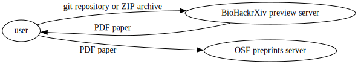
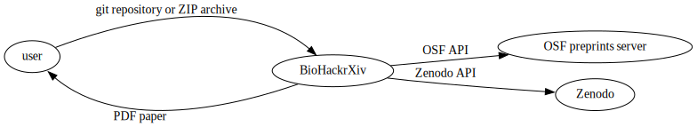

# Introduction

In this paper, we present the work executed on BioHackrXiv during the international ELIXIR BioHackathon Europe 2023 in Barcelona, Spain. [BioHackrXiv](https://biohackrxiv.org/) is a scholarly publication service for biohackathons and codefests that target biology and the biomedical sciences in the spirit of pre-publishing platforms [@citesAsRecommendedReading:preprints]. Over a hundred papers have been published through this system and with the number of biohackathons and codefests increasing every year, we expect this type of reporting and publishing to continue. The goal for this BioHackathon was to improve deployment, enable better collection of metadata, and improve long-term archiving of user repositories.

BioHackrXiv publications are generated from simple but powerful markdown/LaTeX templates, where the header is a YAML/JSON record that includes the title, authors, affiliations and tags. The idea originated from the [pandoc flavoured markdown](https://garrettgman.github.io/rmarkdown/authoring_pandoc_markdown.html) layout that is used in the Journal of Open Source Software (JOSS) [@citesAsAuthority:JOSS]. Templates are provided as an [example](https://github.com/biohackrxiv/publication-template).

As described in the BioHackrXiv ELIXIR 2020 paper [@citesForInformation:bhxiv20] and in the BioHackathon Europe 2022 paper [@citesForInformation:bhxiv22], capturing metadata and acquiring a digital object identifier (DOI) are crucial to publications. DOIs are permanent URIs to PDFs and enable publications to be cited by others. DOIs also support versioning—this means papers can be updated under the same DOI. This is not the case with identifiers from content-addressable systems such as the Interplanetary File System (IPFS).

# Roadmap

A plan of action for a future incarnation of BioHackrXiv was formulated. A detailed description and discussion follows.

## Current system

As it stands, BioHackrXiv only provides a PDF generation service at `preview.biohackrxiv.org`. Users upload a git repository or a ZIP archive, and a PDF paper is generated. Once they are happy with the generated paper, the user must upload it themselves to the OSF preprints server. BioHackrXiv itself does not retain any memory of the PDF papers it generated. All metadata such as author information, BioHackathon event, etc. is lost. The git repository or ZIP archive that was used to generate the PDF is also not retained. State management in curation of publications is outsourced to the OSF preprints server. This means, among other consequences, that there is no way for BioHackrXiv to display a list of accepted publications.

The current implementation of BioHackrXiv is simple in that the preview server is a pure function that retains no state; it is essentially a Software as a Service (SaaS) offering of the BioHackrXiv PDF generator. This makes it easy to deploy and maintain because there is no state to preserve and backup. But, the lack of state is also fundamentally limiting because some state is essential to displaying a list of accepted publications.



## Proposed system

Here's how the new proposed system would work. The user only uploads their git repository or ZIP archive to BioHackrXiv. Once they are happy with the generated paper, they click a *Submit for approval* button. This puts their submission into a curation queue. Once a curator approves, the user's submission is automatically uploaded both to Zenodo and to OSF via their respective APIs.



Implementing this proposed system comes with its own challenges that need to be addressed. We describe them here.

### Persisting user git repositories for posterity

Git repositories provided by the user are usually hosted on GitHub. These repositories are unstable, and may be changed or deleted by the user at a later time. And, relying on proprietary platforms such as GitHub is not good for the longevity of BioHackrxiv. ZIP archives submitted by the user are, of course, ephemeral. In order to archive user-submitted git repositories and ZIP archives for posterity, we need to persist them properly. We decided on persisting these as research artifacts on Zenodo. This not only gives us safe archiving for the foreseeable future, but also provides us a DOI with which to reference the git repository as a research artifact.

### Curation

We need to upload to Zenodo without troubling the user with another manual upload step. Besides, we must only upload approved publications to Zenodo, not everytime the user generates a PDF preview. This means that we can no longer outsource curation management to the OSF preprints server. The BioHackrXiv server needs to manage curation itself. If we are to implement all this, we might as well make it doubly convenient to the user by also automating uploading to the OSF preprints server.

### API accounts on OSF and Zenodo

In the proposed system, the BioHackrXiv server uploads to OSF and Zenodo, not the user. This means that the BioHackrXiv server must have its own OSF and Zenodo accounts. All uploads must go through these accounts and we must be careful not to run afoul of rate limits. Published works must also be correctly attributed to the authors and not to the BioHackrXiv server. As a result, it may be better to link (for example, through something like OAuth) the author's own OSF and Zenodo accounts to BioHackrXiv and use that to upload published works.

## Zenodo API

In Elixir BioHackathon 2022, we had written a Guile program to deposit artifacts via the Zenodo API. We tested this against the sandbox server they provide for testing. This year, in Elixir BioHackathon 2023, we ported this code to Ruby (see supplemental listing below) to better integrate with our existing Ruby codebase.

# Repositories

The web server repositories are hosted on https://github.com/biohackrxiv/. The pandoc and LaTeX templates for PDF generation are at https://github.com/biohackrxiv/bhxiv-gen-pdf. The preview generation web service is at https://github.com/biohackrxiv/preview.biohackrxiv.org.

# Acknowledgements

We thank the organisers of the ELIXIR BioHackathon Europe 2023 for the event and hosting the BioHackrXiv working group. We also thank Database Center for Life Science, Research Organization of Information and Systems, Japan for sponsoring the `osf.io` hosting of BioHackrXiv and we thank initiatives, such as OSF, Zenodo and others that provide these great long lasting APIs.

# Supplemental listing

Ruby script for accessing the Zenodo API and depositing a ZIP file:

\scriptsize

```ruby
require 'json'
require 'net/http'

zenodo_endpoint = URI("https://sandbox.zenodo.org")
access_token = File.read(ARGV[0])
artifact = ARGV[1]
metadata = JSON.parse(File.read(ARGV[2]))

def zenodo_uri(endpoint, path, access_token)
  uri = URI.join(endpoint, path)
  uri.query = URI.encode_www_form({:access_token => access_token})
  uri
end

def zenodo_deposit(endpoint, access_token, artifact, metadata)
  http = Net::HTTP.new(endpoint.host, endpoint.port)
  http.use_ssl = true
  http.start() do |http|
    # Create a deposition with some metadata.
    request = Net::HTTP::Post.new("/api/deposit/depositions?access_token=" + access_token,
                                  initheader = {"Content-Type" => "application/json"})
    request.body = {:metadata => metadata}.to_json
    links = JSON.parse(http.request(request).body)["links"]
    bucket = URI(links["bucket"])
    publish = URI(links["publish"])

    # Upload file.
    request = Net::HTTP::Put.new(bucket.request_uri + "/" + artifact + "?access_token=" + access_token,
                                 initheader={"Content-Type" => "application/octet-stream"})
    request.body = File.read(artifact)
    http.request(request)

    # Publish.
    request = Net::HTTP::Post.new(publish.request_uri + "?access_token=" + access_token)
    JSON.parse(http.request(request).body)
  end
end

print zenodo_deposit(zenodo_endpoint, access_token, artifact, metadata)
```

# References
