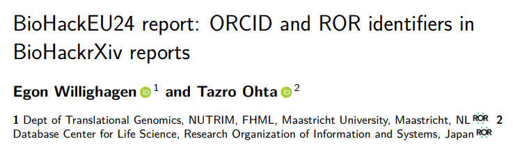

# Introduction

The first BioHackrXiv preprint was published in 2020, using a platform based on the idea
of using Markdown [@citesAsRecommendedReading:bhxiv20], and just weeks ago, BioHackrXiv
published their 100th preprint. Machine-readable etadata added to the Markdown that is
added includes the title, keywords, the author names, their affiliations, and
details about the Biohackathon event the preprint is related to. 
The metadata in 2000 already supported listing the ORCID identifier of the authors,
but this was not added to the author list in the generated PDF [@citesAsRecommendedReading:bhxiv20].

Over the past four years, the platform continued to develop. For example,
at the BioHackathon Europe 2021 Citation Typing Ontology support was added
[@citesAsRecommendedReading:cito1; @citesAsRecommendedReading:cito2]. At the
BioHackathon Europe 2022 the interoperability of the metadata was further
extended with Europe PMC and OpenCitations in mind [@citesAsRecommendedReading:bhxiv22].

As part of the BioHackathon Europe 2024, we here report on two improvements of the
platform: visualization of the ORCID identifiers in the preprint PDF and support
for Research Organization Registry (ROR) identifiers of the affiliations, see
[https://ror.org/about/](https://ror.org/about/).

# Results

While the ORCID was part of the Markdown metadata, at this hackathon we worked
out the changes needed to the LaTeX template used to convert the Markdown into
a PDF. ORCIDs can be added to Markdown metadata as field to the author list,
for example:

\scriptsize

```yaml
authors:
  - name: Egon Willighagen
    orcid: 0000-0001-7542-0286
    affiliation: 1
  - name: Tazro Ohta
    affiliation: 2
```

\normalsize

The ORCID is displayed in the PDF with the ORCID logo and links to the profile
of the author on the ORCID website, see Figure 1. This feature was implemented
with these two pull requests:

* https://github.com/biohackrxiv/bhxiv-gen-pdf/pull/40
* https://github.com/biohackrxiv/bhxiv-gen-pdf/pull/42



Second, with the help from the commonity (see https://mastodon.social/@egonw/113496920614099838).
we added support for the ROR identifier. The ROR identifier of an organization
can be added to the affiliation metadata:

\scriptsize

```yaml
affiliations:
  - name: Dept of Translational Genomics, NUTRIM, FHML, Maastricht University, Maastricht, NL
    ror: 02jz4aj89
    index: 1
  - name: Database Center for Life Science, Research Organization of Information and Systems, Japan
    ror: 018q2r417
    index: 2
```

\normalsize

The ROR is displayed in the PDF with the ROR icon and links to the profile
of the organization on the ROR website, as shown in the above screenshot.
This feature involved one pull request:

* https://github.com/biohackrxiv/bhxiv-gen-pdf/pull/45

The patches are all available from the BioHackrXiv Preview service at
[http://preview.biohackrxiv.org/](http://preview.biohackrxiv.org/). The template
repository at [https://github.com/biohackrxiv/publication-template](https://github.com/biohackrxiv/publication-template)
has also been updated.

# Discussion

While the resulting PDF now include visual indicators and links to ORCID and
ROR profiles of authors and affiliations, the full support is not complete and
propagation of this additional metadata needs to be ensured. This was not
completed during the Biohackathon. Nevertheless, we hope that the new PDFs
encourage more people to use their ORCID and ROR identifiers in BioHackrXiv
preprints.

## Acknowledgements

We thank the organisers of the ELIXIR BioHackathon 2024 for the event and hosting the BioHackrXiv project.
We also thank DBCLS for sponsoring the OSF.io hosting of BioHackrXiv and we thank
the great initiatives, such as OSF, ROR and others that provide the important
open infrastructure needed. Finally, we thank Marei (`@TeXhackse@chaos.social`) and
Charles Tapley Hoyt (`@cthoyt@scholar.social`) for their helpful feedback.

## References
