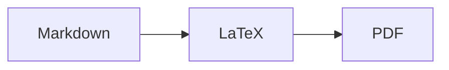

# Introduction

BioHackrXiv continues to host project reports from biohackathon events [@citesForInformation:bhxiv20].
It has published more than 150 preprints and are
[indexed by Europe PMC](https://europepmc.org/search?query=PUBLISHER%3A%22BioHackrXiv%22)
and notable preprints are
[indexed by Wikidata](https://qlever.scholia.wiki/venue/Q115450084) too. It has
supported multiple biohackathons, including the DBCLS BioHackathon and
BioHackathon Europe series. A full overview of supported meetings is available
from the [index.biohackrxiv.org](https://index.biohackrxiv.org/meetings/) website.
The original Markdown setup with metadata in YAML headers [@citesForInformation:bhxiv22] has been
extended since 2020 with support for citation intent annotations with the
Citation Typing Ontology [@citesForInformation:bhxiv23], making ORCID identifiers for authors and
ROR identifiers for research organizations visible in the PDFs [@citesForInformation:bhxivEU24],
and support for the Contributor Role Taxonomy (CRediT) annotation of author roles
[@usesMethodIn:McNutt2018].
These things have been developed with the help of the same communities BioHackrXiv
supports.

Authors have adopted many of these new features. For example, 48 BioHackrXiv reports
have used CiTO citation intent annotations. They have also repeated indicated a number
of shortcomings in the system. For example, when many authors have contributed to
a preprint, then the "BioHackathon series" infobox no longer has a controlled
vertical location, sometimes even dropping of the front page. Other comments
have been that the new CRediT attribution was only listed after the *References*,
while appendices were impossible to put after the *References*.

Besides the updates to the [preview.biohackrxiv.org](https://preview.biohackrxiv.org/)
website, updates to the [publication template](http://github.com/biohackrxiv/publication-template/),
also updates have been made for the preprint template. This we describe in this
preprint.

# Improvements in the past year

## Upgrade of tools to generate the PDF

First, the whole PDF generation workflow of the `gen-pdf` tool has been upgraded
to use Ruby 3.3, Pandoc 3, use of the LuaLaTeX PDF engine, and the use of biber.
These changes have migrated to the Docker image and the GitHub Action that uses
that Docker image.

## Improvements on the first page

We further improved the layout of the front page. The list of authors can now be
much longer than before. And LaTeX now aligns the "BioHackathon series" infobox
with the top of the author list, ensure the full visibility of that box.

## Author contributions

The "Author contributions" section is now only visible when author roles have
been defined, such as in this preprint. If none are defined, then the section
header is hidden. Second, the section is now displayed before the *References*
section, and the roles information per authors is now separated by a semicolon.

## CJK characters

We are also excited with the support for CJK characters (Japanese, Chinese,
Korean) and extended Unicode support, thanks to the migration to LuaLaTeX.
For example, this now works: the Biohackathion 2019 was organized in
Fukuoka (福岡), Japan.

## Appendices

Some of the above work has been supported by large language models (LLMs)
which came up with suggestions. The build system is quite complex but modern
LLMs are nowadays able to make small, clean patches. One suggestion if came
up with, is the trick that authors can use to ensure that an appendix they
wish to add can be after the References list. First, a Markdown code block can
be annotated to be interpreted as LaTeX with <code>&grave;&grave;&grave;{=latex}</code>.
This way, the
source in these code blocks is passed verbatim into the LaTeX intermediate created
by Pandoc, giving access to the richer LaTeX formatting language.

This way, all material that is to be placed after the *References* can be wrapped
in two LaTeX code block: a LaTeX block is opened with `\AtEndDocument{%`, followed
by the regular Markdown content after that first block. After all appendix material,
a second LaTeX block is given with merely `}`. A full example is given in the
[publication template](http://github.com/biohackrxiv/publication-template/).

## (Soon) Mermaid support

Not ready yet, but a first draft pull request has been developed for support
of [Mermaid](https://mermaid.js.org/) which can be embedded in Markdown. This is
not a core Markdown feature, but supported in Markdown by, for example, GitHub.
The new pull request updates the PDF build system to extract instructions
from mermaid code blocks, create SVG, and embed this in the resulting PDF.

That allows us to include diagrams like this:

Check the Markdown [source of this report](https://github.com/biohackrxiv/bhxiv-metadata/tree/main/doc/intermediate2026/)!

# Conclusions

We hope you like these improvements and make your BioHackrXiv experience even
more fun!

# Acknowledgments

We thank Charles Tapley Hoyt for help with embedding the ROR logo in the template,
Gerhard Burger for starting the GitHub Action to create preprint PDFs in
forks of the template repository, and Salvatore Cosentino for contributions to
`README.md` of the `bhxiv-gen-pdf` repository.

# References
