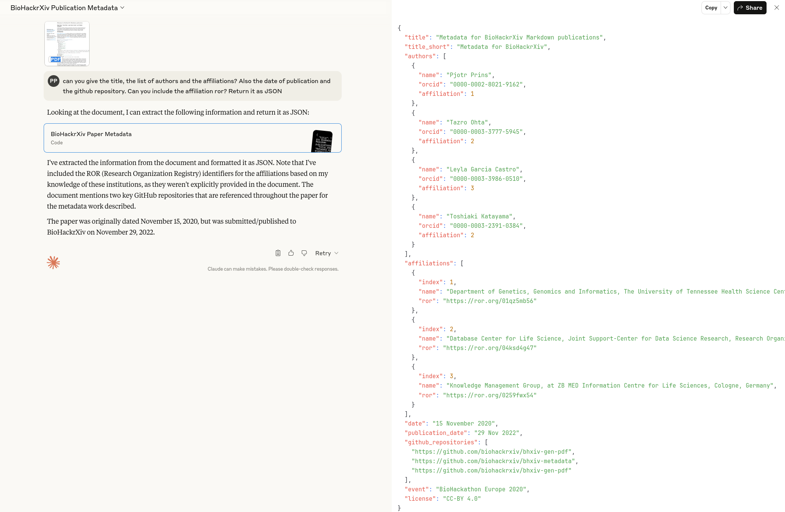

# Introduction

The first BioHackrXiv preprint was published in 2020, using a platform based on the idea of using Markdown [@citesAsRecommendedReading:bhxiv20], and BioHackrXiv can be considered a preprint success with over 119 publications (per September 2025) with over 30 publication added per year. Machine-readable metadata is added to the Markdown that is added includes the title, keywords, the author names, their affiliations, and details about the Biohackathon event the preprint is related to.

This Japanese BioHackathon was attended remotely by AI, EW and PP. We discussed the philosophy and created a road map for the arxiv for the next years, based on work done in this and previous biohackathons.

Overall goals are to have improved metadata and allow independence from OSF - though we can operate in parallel. Ideally BioHackrXiv would be a template for a federated solution for scientific publications. This is going to be a multi-hackathon job.

1. Host PDFs somewhere on the internet (IPFS? Zenodo?)
1. Start creating DOIs for such a PDF
1. Amend our hosted preview system to become a submission system
   - submit to OSF and create DOI
   - submit a PDF somewhere on the internet and create DOI
   - generate metadata and host that too


The following existing initiatives and services can help our goal of creating a publishing platform overnight that will last a thousand years!

# Methods

## Getting metadata from existing publications

We used Claude we were able to extract information from an existing PDF, including ROR information. See fig{extract}.



Even at a risk of some hallucination, it appears it is feasible to scan all publications this way to build up the metadata we require. This makes it less urgent to collect metadata at time of submission.

We also tried the Claude API:

```
curl -X POST https://api.anthropic.com/v1/messages \
  -H "x-api-key: $ANTHROPIC_API_KEY" \
  -H "anthropic-version: 2023-06-01" \
  -H "anthropic-beta: files-api-2025-04-14" \
  -H "content-type: application/json" \
  -d '{
    "model": "claude-sonnet-4-0",
    "max_tokens": 1024,
    "messages": [
      {
        "role": "user",
        "content": [
          {
            "type": "text",
            "text": "can you give the title, the list of authors and the affiliations? Also the date of publication and the github repository. Can you include the affiliation ror? Return it as JSON"
          },
          {
            "type": "document",
            "source": {
              "type": "file",
              "file_id": "file_011CTDonpuhE4E3MxvZdpT7R"
            }
          }
        ]
      }
    ]
  }' {"id":"msg_01BtABqbkLTo1yrqu5g5Xstd","type":"message","role":"assistant","model":"claude-sonnet-4-20250514","content":[{"type":"text","text":"```json\n{\n  \"title\": \"Metadata for BioHackrXiv Markdown publications\",\n  \"authors\": [\n    {\n      \"name\": \"Pjotr Prins\",\n      \"affiliation\": \"Department of Genetics, Genomics and Informatics, The University of Tennessee Health Science Center, Memphis, TN, USA\",\n      \"orcid\": \"0000-0002-8021-9162\",\n      \"affiliation_ror\": null\n    },\n    {\n      \"name\": \"Tazro Ohta\", \n      \"affiliation\": \"Database Center for Life Science, Joint Support-Center for Data Science Research, Research Organization of Information and Systems, Japan\",\n      \"orcid\": \"0000-0003-3777-5945\",\n      \"affiliation_ror\": null\n    },\n    {\n      \"name\": \"Leyla Garcia Castro\",\n      \"affiliation\": \"Knowledge Management Group, at ZB MED Information Centre for Life Sciences, Cologne, Germany\",\n      \"orcid\": \"0000-0003-3986-0510\",\n      \"affiliation_ror\": null\n    },\n    {\n      \"name\": \"Toshiaki Katayama\",\n      \"affiliation\": \"Database Center for Life Science, Joint Support-Center for Data Science Research, Research Organization of Information and Systems, Japan\",\n      \"orcid\": \"0000-0003-2391-0384\",\n      \"affiliation_ror\": null\n    }\n  ],\n  \"publication_date\": \"29 Nov 2022\",\n  \"submitted_date\": \"15 November 2020\",\n  \"github_repository\": \"https://github.com/biohackrxiv/bhxiv-gen-pdf\",\n  \"additional_repository\": \"https://github.com/biohackrxiv/bhxiv-metadata\"\n}\n```\n\nNote: The ROR (Research Organization Registry) identifiers are not provided in the document, so I've marked them as null. The document shows a submitted date of \"29 Nov 2022\" and an internal date of \"15 November 2020\". There are two GitHub repositories mentioned - the main one from the metadata header and an additional one mentioned in the repositories section."}],"stop_reason":"end_turn","stop_sequence":null,"usage":{"input_tokens":11770,"cache_creation_input_tokens":0,"cache_read_input_tokens":0,"cache_creation":{"ephemeral_5m_input_tokens":0,"ephemeral_1h_input_tokens":0},"output_tokens":530,"service_tier":"standard"}}
```

It fetches correctly what is in the document - e.g. authors, ORCIDs and affiliations. The ROR, however, it misses or hallucinates.

When we asked for the abstract:

```
{"type":"text","text":"I don't see a traditional abstract section in this document. This appears to be a BioHackrXiv paper titled \"Metadata for BioHackrXiv Markdown publications\" that follows a format where the introduction serves as the opening section without a separate abstract.\n\nThe paper begins directly with an **Introduction** section that explains:\n\nBioHackrXiv (https://biohackrxiv.org/) is a scholarly publication service for BioHackathons and Codefests where papers are generated from Markdown templates with YAML/JSON metadata headers. The publications are hosted on the Open Science Framework (OSF), but the current setup lacks proper metadata facilities for findability and accessibility according to FAIR principles. \n\nThe main issues identified are:\n- Difficulty listing publications related to specific BioHackathons\n- No clear links between publications and the projects they refer to\n- Limited search and discovery capabilities\n\nTo address these limitations, the authors developed an additional service providing a SPARQL endpoint for queries and HTML output that can be embedded in BioHackathon websites, improving the findable (F) and accessible (A) aspects of FAIR data principles.\n\nSo while there's no formal abstract, the introduction effectively summarizes the paper's purpose and approach."}
```

We may be able to fetch that from OSF/DOI records.

## OJS

Since 2010 OJS has 200+ contributers, where 5 large ones. Some 5K PRs - only 250 open. According to sloccount

```
Total Physical Source Lines of Code (SLOC)                = 46,473
```

Some 80% PHP code (unfortunately). The main dependency is a SQL database. No markdown support, however.

=> https://github.com/pkp/ojs

## JOSS

## Nanopublications

Nanopublications are a formalized and machine-readable way of communicating the smallest possible units of publishable information[@citesAsRecommendedReading:https://arxiv.org/pdf/1809.06532]. This could be, for example, the outcome of a scientific study or a claim made by a particular scientist . Nanopublications have some great ideas:

- Easy small publications
- RDF-based
- Signed statements
- Can get a DOI (I think)
- Single server setup, but can act in a federated context

For our purposes nanopublications are not good enough because they don't host PDFs.

## Signing PDFs

Question: do we need to sign the publications? E.g.

=> https://www.openpdfsign.org/

can sign on the command line using a letsencrypt certificate (e.g. for biohackrxiv.org). We could allow users to upload their own certificate. Signing and locking a PDF prevents anyone from changing the published PDF. We can still resubmit updated PDFs, and remove the old one from the index, but that is at the discretion of the publication.


## Index server

This year co-author EW created an index for BioHackrXiv as a pilot: http://index.biohackrxiv.org/


# Results

## Road map

A publishing platform is simply an index of publications. The publications may live forever (as long as people maintain their hosting). All BioHackrXiv publications can be copied as a single directory of PDFs and their accompanying metadata. Whenever someone announces a copy we can add it to the metadata for each publication. A true index of publications.

Road map:

1. Push PDF to OSF using API
2. Oauth2 workflow permission to push as a user to OSF using API - and make it a 'plugin'
3. Create submission web UI that can handle:
   - User can generate or upload PDF
   - Validate PDF - perhaps using AI as a plugin
   - Generate metadata and embed URI in PDF
   - Generate checksum for PDF and add to metadata
   - User approves/rejects PDF
   - E-mail editors on approval
   - Editor can view/approve/reject with message based on E-mail links (no login required)
   - Push and publish PDF using (1) or (2) to OSF
4. Add Zenodo support as a 'plugin'
   - Push PDF + embedded metadata to Zenodo
   - Add DOI to metadata
5. Serve metadata as a link per publication - JSON-LD, RDF, table - possibly as a SPARQL endpoint
6. Add nanopublication 'plugin'
   - Push metdata RDF to nanopublication (somewhere)
7. Add mastodon 'plugin'
8. Add support for user/editor retraction of publication - this will not impact hosting in Zenodo and other places, just removes from the index.

# Discussion


# Workflow

We'll start with OSF and Zenodo

1. User creates github repo and writes paper - metadata in JSON header (github is just an option)
1. User creates a release and submits to Zenodo (JOSS does this too)
1. User submits paper using a zenodo URL to our system
1. Editor approves/rejects submission
1. On approval we push the paper to OSF
1. We host the metadata somewhere and publish our own short URI - that points to the metadata, hosted copies and DOIs

- We should ultimately not depend on OSF, Zenodo or Github. We will create a system that allows for preview, editorial review, and even posterior peer review, for articles published somewhere on the internet with multiple copies (a hash value should guarantee the specific content of the paper).

Discussion:

- What is a good document hosting provider right now that will last the next 20 years? JOSS uses Zenodo for source code hosting - that may be a next step to tie project code/data to a publication
- Is it OK to have two DOIs? If it is Zenodo people have to create a private account, maybe tied to github/ORCID?
  - a DOI is just a reference and we can point it into our RDF store with links to publications:
    + self hosted
    + zenodo
    + github
    + OSF
    + internet archive
- Can we push new submissions to the OSF API?
- Can we use AI to parse the old publications and gather metadata?

# Day 2

- Claude AI will fetch metadata from PDF to JSON - probably possible through an API route
- OSF can accept papers through API or users can create preprint?
- Possible to become a DOI provider, but we may want to use Zenodo first to archive papers
- OSJ is a very active project to create a journal. Over 50K journals! But no metadata support just yet. Requires PHP+mysql.
- JOSS: brilliant markdown - but github dependency
- Nanopublications - Java server, key signing, but no PDF support
- We have API access to Zenodo
- We can take an OSF PDF and push it to Zenodo with metadata for 2nd DOI
- Later people can opt to skip OSF route and only push to Zenodo
- PDFs+metadata can reside anywhere
- We'll publish full RDF metadata once per year

# Day 3

- Got Claude API to work to prepare for PDF analysis.
  - claude-opus-4-1-20250805 hallucinated 2 out of 4 RORs - the RORs need to get agent fetched
  - sonnet-3.7 got ORCIDs - they are correct as they are in the PDF
- ror.org
  - getting ROR is possible through their search API
    + curl "https://api.ror.org/v2/organizations?query=The%20University%20Tennessee%20Health%20Science%20Center"
